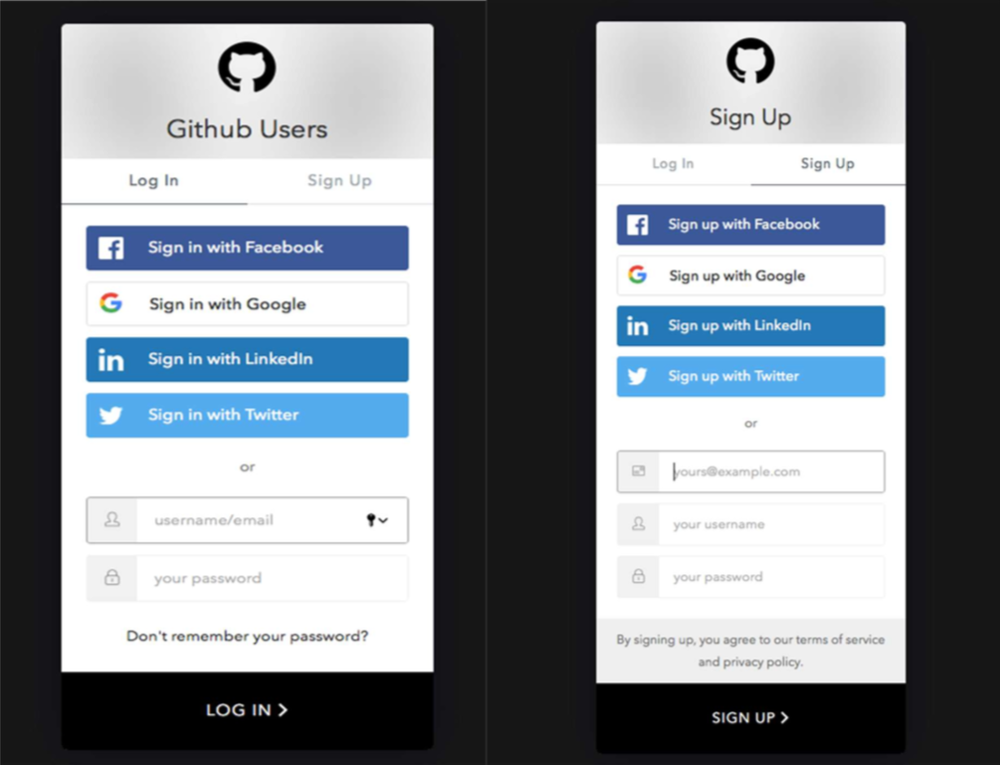
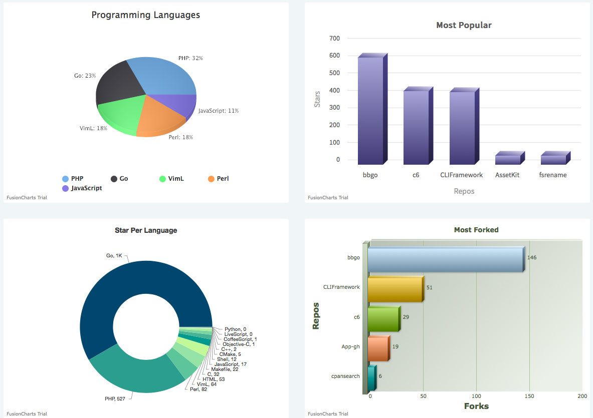

## Github Users

Github Users is an application where a user can make 60 searches per hour after registration, see how many followers the GitHub user has, how many people they follow, as well as the user's repos and the most used programming languages.

## Login Page

## Home Page

## Check the Website

[Github Users](https://github-users-searching-project.netlify.app)

